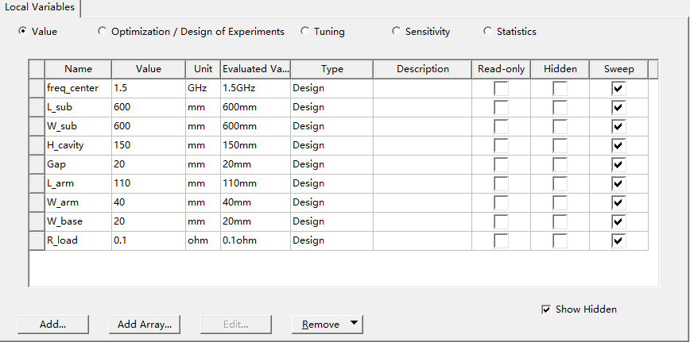
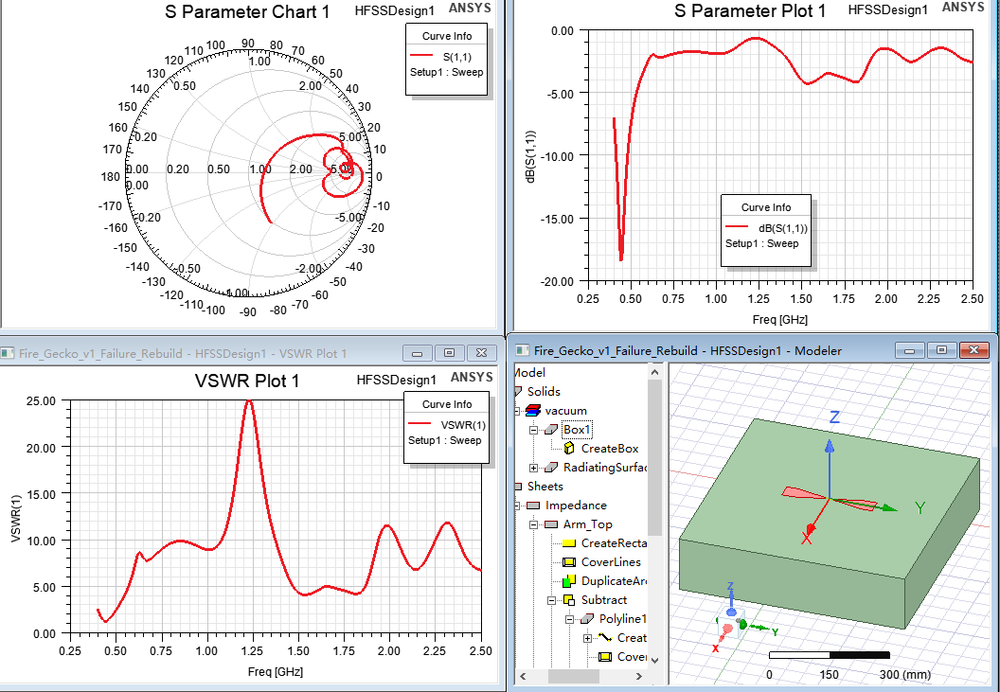
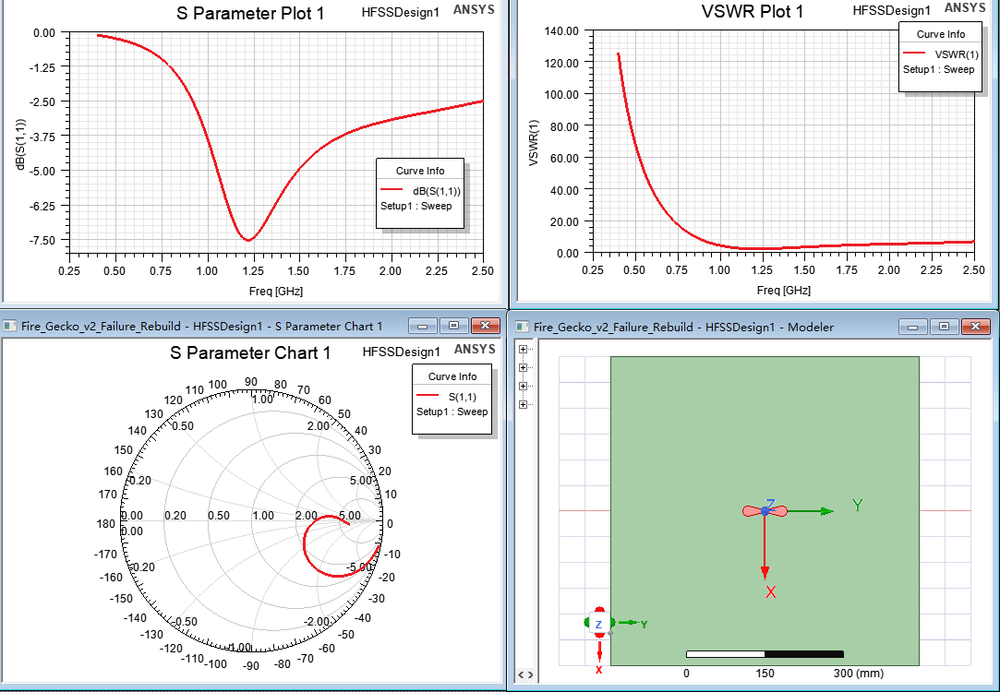
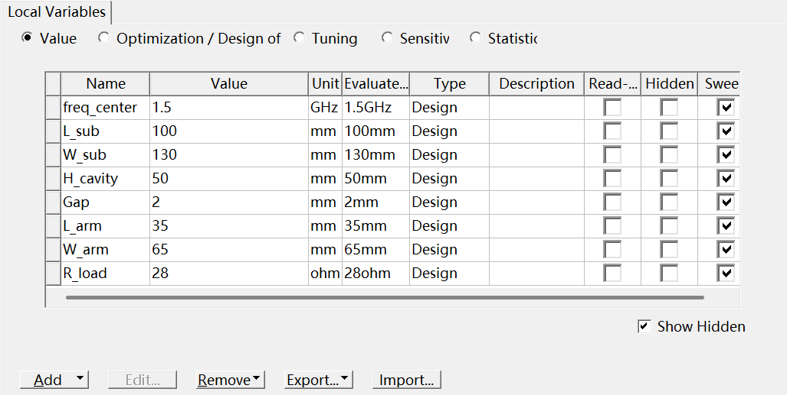
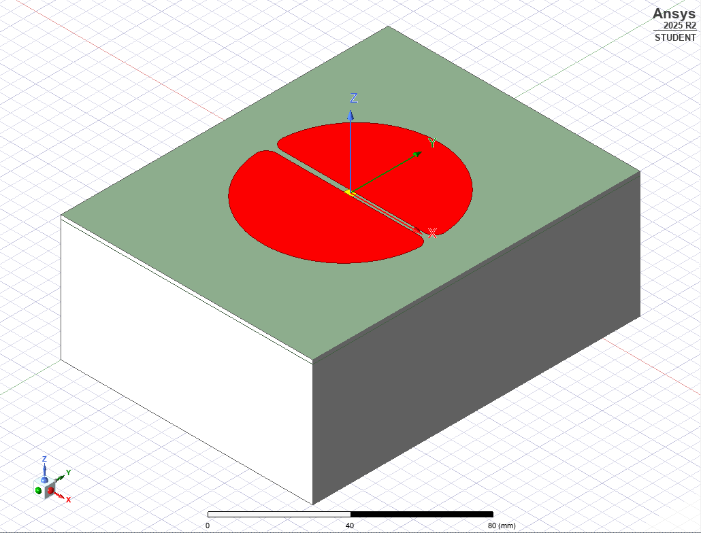
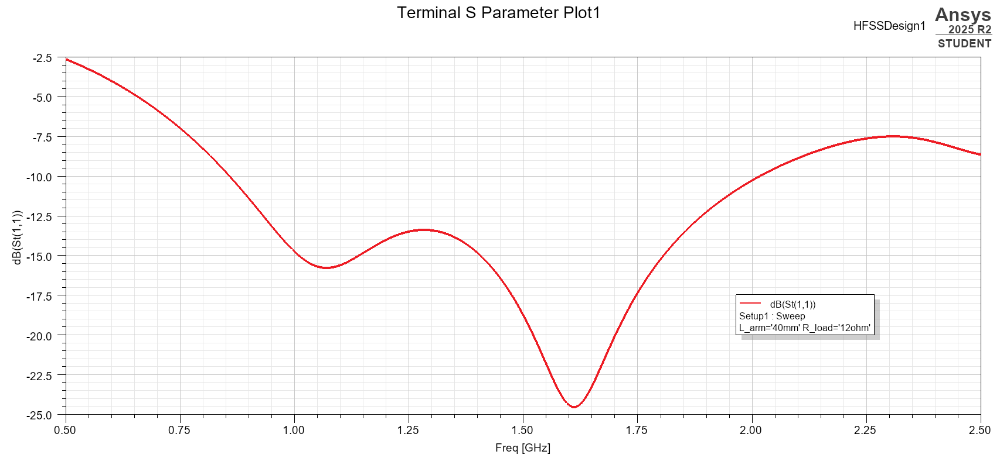
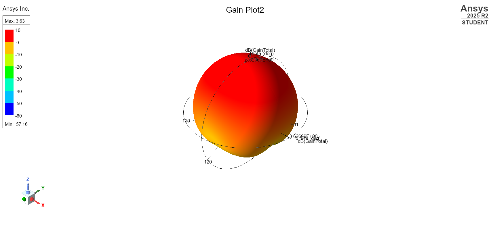
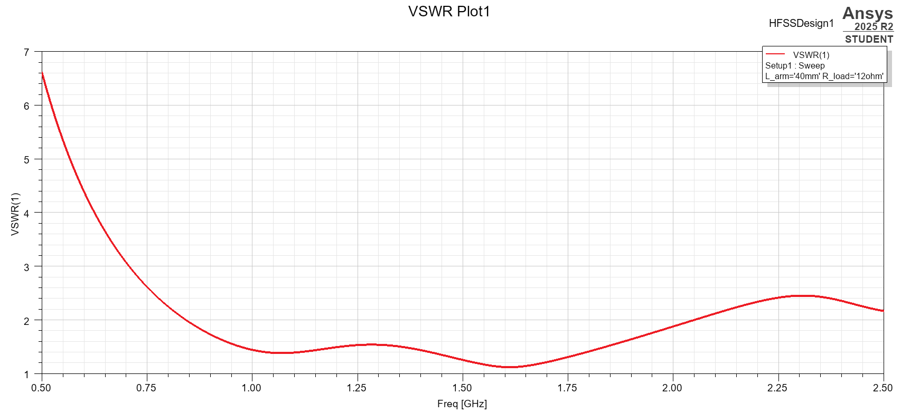
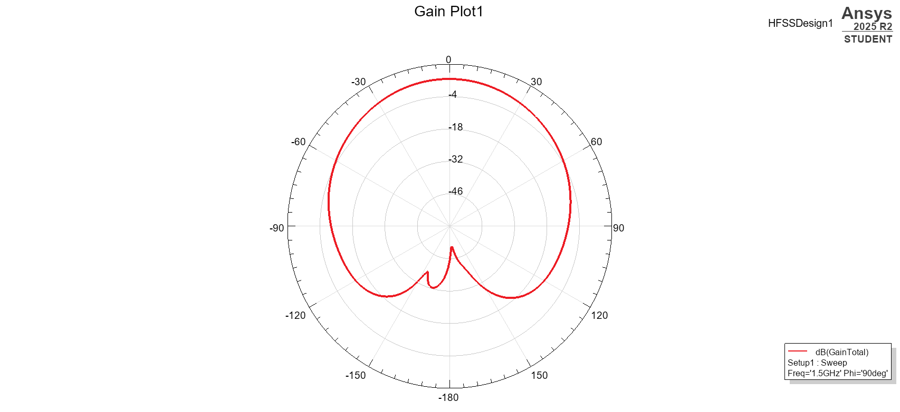

# Fire-Gecko UWB Antenna Engineering Log

# 火壁虎雷达天线工程设计日志

**Project**: Fire-Gecko Through-Wall Radar
**Component**: RF Front-end / UWB Antenna
**Date**: 2026-01-01
**Version**: v1.0 (Final Release)
**Status**: Frozen for Fabrication / 定型投产

---

## 1. 设计目标 (Design Objectives)

**[CN]**
针对 SFCW (步进频率连续波) 穿墙雷达系统，设计一款满足以下指标的天线：

* **中心频率**: 1.2 GHz (兼顾穿墙能力与分辨率)
* **带宽**: 0.8 GHz - 1.8 GHz (超宽带 UWB)
* **S11**: < -10 dB (全频段)，中心频点 < -15 dB
* **结构**: 平面印制板 (PCB) + 金属背腔 (Cavity)

**[EN]**
Design an antenna for the SFCW Through-Wall Radar system meeting the following specs:

* **Center Freq**: 1.2 GHz (Balance between penetration and resolution).
* **Bandwidth**: 0.8 GHz - 1.8 GHz (UWB).
* **S11**: < -10 dB (full band), < -15 dB @ Center Freq.
* **Structure**: PCB + Metal Back Cavity.

---

## 2. 设计演进与复盘 (Design Evolution & Analysis)

### Phase 1: 梯形偶极子 (Trapezoidal Dipole) - [FAILED]

**[CN] 现象与分析：**

* **现象**: S11 曲线几乎贴着 0 dB 线震荡，表现为全反射，无法匹配。
* **死因 1 (尖角效应)**: 梯形结构在馈电处存在尖锐折角。高频电流在尖角处无法顺滑流动，产生强烈的寄生电容和反射。*这就像水流在直角弯管处被堵回来了一样。*
* **死因 2 (背腔窒息)**: 初始背腔深度 ($H=150\text{ mm}$) 过深，远大于 1/4 波长。反射波与发射波相位相反 (180°)，两者相互抵消，导致辐射电阻趋近于零，能量被“闷”死在天线里。

**[EN] Observation & Analysis:**

* **Observation**: The S11 curve oscillates near 0 dB, indicating total reflection and mismatch.
* **Root Cause 1 (Corner Effect)**: Sharp corners at the feed point caused severe impedance discontinuity. High-frequency currents could not flow smoothly, creating parasitic capacitance. *Analogy: Water flow blocked by a sharp right-angle pipe.*
* **Root Cause 2 (Cavity Choking)**: The initial cavity depth ($H=150\text{ mm}$) was too deep (>> $\lambda/4$). The reflected wave was 180° out of phase with the incident wave, causing destructive interference. The radiation resistance dropped to near zero, effectively choking the radiation.

**📸 仿真截图 (Simulation Plots):**

---

### Phase 2: 水滴形渐变 (Teardrop Taper) - [POOR PERFORMANCE]

**[CN] 现象与分析：**

* **改进**: 引入指数渐变 (Teardrop) 消除尖角。
* **现象**: S11 出现改善，但在 1 GHz 处出现一个极窄的深坑 (-38 dB)，其他频段依然很差。
* **死因 (高 Q 值谐振)**: 此时天线变成了一个 **高 Q 值谐振器**（像一个铃铛）。它只在特定频率“响”得很大声，但带宽极窄。雷达发射宽带信号时，这种天线会引入严重的信号失真（振铃效应），无法使用。

**[EN] Observation & Analysis:**

* **Improvement**: Introduced exponential teardrop taper to eliminate sharp corners.
* **Observation**: S11 improved but showed a very narrow, deep dip (-38 dB) at 1 GHz, acting like a high-Q resonator.
* **Root Cause (High-Q Resonance)**: The antenna acted like a "bell" — resonating strongly at a single frequency but lacking bandwidth. For UWB radar, this high-Q characteristic causes severe signal distortion (ringing) and is unusable.

**📸 仿真截图 (Simulation Plots):**

---

### Phase 3: 最终定型 (Final Release V3) - [SUCCESS]

**[CN] 最终方案 (Solution)：**
经过参数扫描与物理分析，确定了 **“电阻加载 + 深度背腔”** 的最终方案。

1. **尺寸匹配**: 臂长 $L_{arm}=40\text{ mm}$，背腔深度 $H=50\text{ mm}$（匹配 1.5 GHz、1/4 波长）。
2. **电阻加载 (Resistive Loading)**: 引入 **12 Ω ($R_{load}$)** 电阻。
   * *原理*: 电阻吸收了天线上的驻波能量，强行降低了 Q 值，将尖锐的谐振峰“压平”为宽带的响应。
   * *代价*: 牺牲了部分增益 (Gain) 换取了完美的带宽 (Bandwidth)。

**[EN] Final Solution:**
Optimized through parametric sweeps and physical analysis:

1. **Dimension Matching**: Arm length $L_{arm}=40\text{ mm}$; cavity depth $H=50\text{ mm}$ (matching $\lambda/4$ at 1.5 GHz).
2. **Resistive Loading**: Introduced a **12 Ω ($R_{load}$)** parallel resistor.
   * *Mechanism*: The resistor absorbs standing wave energy, forcibly damping the Q-factor and flattening the sharp resonance into a broadband response.
   * *Trade-off*: Sacrificed some peak gain for perfect UWB bandwidth stability.

**[CN] 最终性能 (Performance):**

* **增益 (Gain)**: **3.62 dBi** (在效率与带宽间取得最佳平衡)。
* **S11**: 在 1.2 GHz 处达到 **-50 dB** (完美匹配)。
* **方向性**: 能量集中指向 Z 轴正向，背瓣极小。

**📸 仿真截图 (Simulation Plots):**

| S11 最终结果 (Final S11) | 3D 辐射方向图 (3D Gain) |
| :---: | :---: |
|  |  |
| **VSWR 最终结果 (Final VSWR)** | **2D 辐射方向图 (2D Gain)** |
|  |  |

---

## 3. 制造与组装 (Fabrication Notes)

**[CN]**

* **PCB**: FR-4 (1.6 mm), 2 层板。
* **SMA**: 使用弯头 (Right-Angle) SMA (如 C15673)。**注意**：SMA 的四个地脚焊在下水滴，中心针跨接至上水滴。下水滴需做挖孔 (Cutout) 处理以防短路。
* **电阻**: 0805 封装，12 Ω，并联在馈电处。

**[EN]**

* **PCB**: FR-4 (1.6 mm), 2 layers.
* **SMA**: Right-angle SMA (e.g., C15673). **Note**: Ground pins on the bottom arm; signal pin bridges to the top arm. A cutout on the bottom arm is required to prevent the signal pin from shorting to ground.
* **Resistor**: 0805 package, 12 Ω, soldered in parallel at the feed gap.
